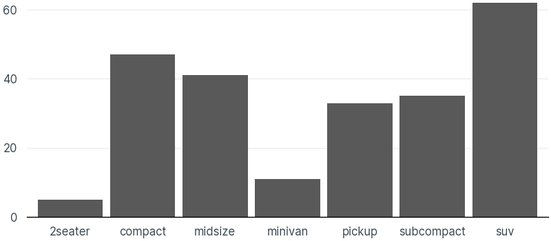
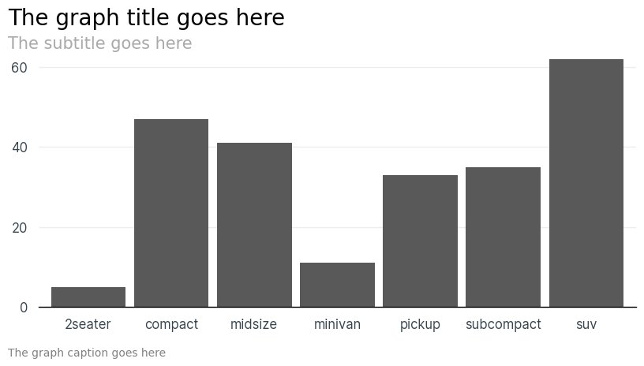
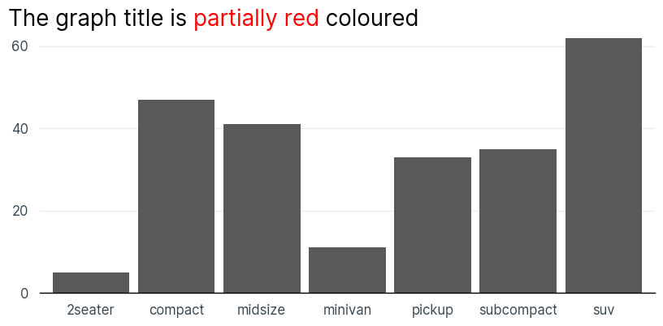
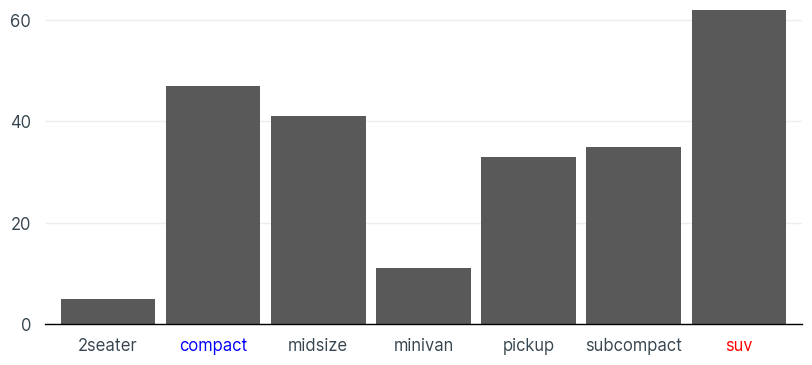

# brandtemplate

A customisable package to enable the creation of [Quarto](https://quarto.org/) presentations using your own brand to share the output of your python based analysis to stakeholders. 

The template uses plotnine and great-tables to create graphs and tables and has themes for both of these that go with the quarto template.

The template uses the presoutput package ([PYPI](https://pypi.org/project/presoutput/) or [github](https://github.com/aplunket/presoutput)) to convert the .qmd files into either PDF or PPTX documents that can be shared with stakeholders.

## Customisation of template

- Fork this repo to create your own master template.
- Update `config.yaml` in `template_config` to update the formatting of the template.
  - If changing the fonts add the new font files into `brandtemplate/template_files/font` and delete the existing files.
  - Change the background and logo image files in `brandtemplate/template_files` to the ones for your brand. This can be copied out of your PowerPoint template and saved as an image.
- Run `python template_config/template_config.py` to update the template based on the changes to your `config.yaml`.
- Make any changes to `PACKAGE.md` to update the documentation for how to install the package if using a private repo.

## Build and publish template

- Install poetry - `pip install poetry`
- Install the packages for the template - `poetry install`
- Build the package - `poetry build`
- Add config to enable publishing
  - If publishing to PYPI then can use `poetry config pypi-token.pypi <YOUR_PYPI_API_TOKEN>`
  - If publishing this to a private repository then see the [poetry documentation](https://python-poetry.org/docs/repositories/#publishing-to-a-private-repository) for more information

## Installation

Install the package via `pip install brandtemplate`

*You might need to update this command if you have customised this template and you are using a private repository to store your package.*

## Usage

### Add the quarto template to a project

Run the following command via command line to import the template into the current working directory.

```{bash}
brandtemplate-import
```

This command has the following optional arguments:
- `-n` or `--name`: Renames the qmd file when importing the template. Defaults to "template.qmd" if omitted.
- `-d` or `--directory`: Specifies what directory to copy the template into. Defaults to the current working directory if omitted.

The below line of code would create a qmd file called `presentation.qmd` in the `output` folder within the current directory and would copy all the files needed for the template into `_extensions/brandtemplate`.

```{bash}
brandtemplate-import -n presentation.qmd -d output
```

### Plotnine helper functions

#### Add theme to graph 

```{python}
from plotnine import *
from plotnine.data import mpg

from brandtemplate import brandtemplate_plotnine_theme #import theme function

(
ggplot(mpg, aes(x='class')) +
  geom_bar() +
  scale_y_continuous(expand=(0,0)) +
  brandtemplate_plotnine_theme() #adds base formatting theme to graph
)
```



#### Add standard titles to graph 

```{python}
from plotnine import *
from plotnine.data import mpg

from brandtemplate import brandtemplate_plotnine_theme, plotnine_titles

graph = (
ggplot(mpg, aes(x='class')) +
  geom_bar() +
  scale_y_continuous(expand=(0,0)) +
  brandtemplate_plotnine_theme() 
)

#add titles to the graph
plotnine_titles(
  graph,
  title='The graph title goes here',
  subtitle='The subtitle goes here',
  caption='The graph caption goes here'
  )
```



#### Add complex titles to the graph

The below example shows how can add mutiple colours to the title of a graph but the same can be done for the subtitle and caption and for the colour and size of each title.

```{python}
from plotnine import *
from plotnine.data import mpg

from brandtemplate import brandtemplate_plotnine_theme, plotnine_titles

graph = (
ggplot(mpg, aes(x='class')) +
  geom_bar() +
  scale_y_continuous(expand=(0,0)) +
  brandtemplate_plotnine_theme() 
)

plotnine_titles(
  graph,
  title=['The graph title is ', 'partially red', ' coloured'],
  title_color=['black', 'red', 'black']
  )
```



#### Recolour axis labels 

```{python}
from plotnine import *
from plotnine.data import mpg

from brandtemplate import brandtemplate_plotnine_theme, plotnine_coloured_axis_labels

graph = (
ggplot(mpg, aes(x='class')) +
  geom_bar() +
  scale_y_continuous(expand=(0,0)) +
  brandtemplate_plotnine_theme() 
)

plotnine_coloured_axis_labels(
  graph,
  label_color_dict={'compact':'blue', 'suv':'red'},
  axis='X'
  )
```



## Features

### Quarto template

The quarto template has been designed to match your current brand presentation theme so that you can focus on the content rather than having to focus on the formatting. 

- New slides are created by creating a H2 in the qmd file (using `## Slide title goes here`).
- To create a section divider slide you can add the following line `## Slide title goes here {.section-slide}`
- To create a final thank you slide you can add the following line `## Thank you {.thank-you-slide}`
- Multiple columns can be created using the following code:
  ```{quarto}
  :::: {.columns}

  ::: {.column width="50%"}
  Left column
  :::

  ::: {.column width="50%"}
  Right column
  :::
 
  ::::
  ```

See full documentation on revealjs in quarto [here](https://quarto.org/docs/presentations/revealjs/).

Once ready to share then can use the presoutput package ([PYPI](https://pypi.org/project/presoutput/) or [github](https://github.com/aplunket/presoutput)) to convert the file to either PDF or PPTX format.

### plotnine helper functions

The following functions are available for use with the template

- **brandtemplate_plotnine_theme**: A base theme for plotnine graphs that removes a lot of the unnecessary elements.
- **plotnine_titles**: Create better titles for plotnine including being left aligned to the graph and the ability to recolour / resize different parts of a title.
- **plotnine_text**: Add text anywhere on the graph. The text can have multiple colours, size, weight, style.
- **plotnine_coloured_axis_labels**: Recolour individual axis labels to highlight a data point on your graph.

### great-tables helper functions

To be added once opt_css is added to great-tables.